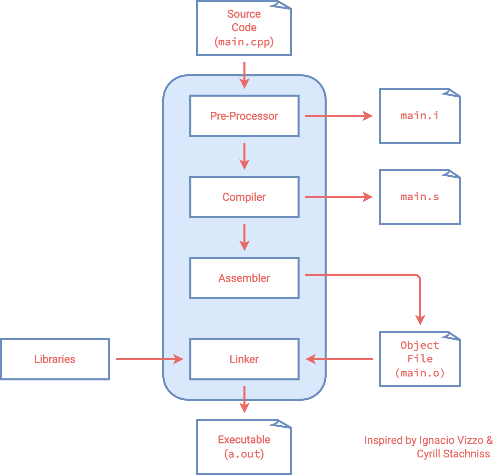

# BuildingCPP

Tutorial on the C++ building process and how to build using CMake. I believe the C++ building process has tortured many more than me, this tutorial is my attempt to solve that problem once and for all. I will first show the most basic version of compiling C++ code, then go through the compiling process, finally show how to compile projects using CMake.

## Compiling 101

Let's start with the `hello_world` example

```cpp
#include<iostream>

int main(){
    std::cout << "Hello World" << std::endl;
    return 0;
}
```

This can be compiled using 

```console
clang++ hello_world.cpp -o a.out

# or

g++ hello_world.cpp -o a.out
```

Here `clang++` and `g++` are two different compilers, `hello_world.cpp` specifies the name of the `.cpp` file that we want to compile, `-o` tag means we want to specify the name of the output executable, and `a.out` is the name of the executable that we chose. Run the command with the `hello_world.cpp` example in the `compiling_101` file and see if it works.

Now that we see how we can compile files, let's try to understand what is going on behind the scene.

## How the compiler works



When you compile the hello world example, four steps occurred

- Pre-process
- Compile
- Assembly
- Link